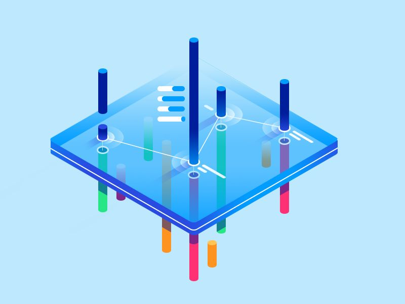
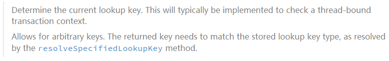

## mTxn | SpringBoot多数据源及事务解决方案



### 1. 背景

维护一个主库和N个应用库的数据源，并且会同时操作主库和应用库的数据，需要解决以下两个问题：

1. 如何动态管理多个数据源以及切换？
2. 如何保证多数据源场景下的数据一致性（事务）？

本文主要探讨这两个问题的解决方案，希望能对读者有一定的启发。

### 2. 数据源切换原理

通过扩展`Spring`提供的抽象类`AbstractRoutingDataSource`，可以实现切换数据源。其类结构如下图所示：


* `targetDataSources&defaultTargetDataSource`

  项目上需要使用的所有数据源和默认数据源。

* `resolvedDataSources&resolvedDefaultDataSource`

  当`Spring`容器创建`AbstractRoutingDataSource`对象时，通过调用`afterPropertiesSet`复制上述目标数据源。由此可见，一旦数据源实例对象创建完毕，业务无法再添加新的数据源。

* `determineCurrentLookupKey`

  此方法为抽象方法，通过扩展这个方法来实现数据源的切换。目标数据源的结构为：`Map<Object, DataSource>`其`key`为`lookup key。

  我们来看官方对这个方法的注释：



`lookup key`通常是绑定在线程上下文中，根据这个`key`去`resolvedDataSources`中取出`DataSource`。

根据目标数据源的管理方式不同，可以使用基于配置文件和数据库表两种方式。基于配置文件管理方案无法后续添加新的数据源，而基于数据库表方案管理，则更加灵活。

### 3. 配置文件解决方案

根据上面的分析，我们可以按照下面的步骤去实现：

1. 定义`DynamicDataSource`类继承`AbstractRoutingDataSource`，重写`determineCurrentLookupKey()`方法。
2. 配置多个数据源注入`targetDataSources`和`defaultTargetDataSource`，通过`afterPropertiesSet()`方法将数据源写入`resolvedDataSources`和`resolvedDefaultDataSource`。
3. 调用`AbstractRoutingDataSource`的`getConnection()`方法时，`determineTargetDataSource()`方法返回`DataSource`执行底层的`getConnection()`。

其流程如下图所示：


####  3.1 创建数据源

`DynamicDataSource`数据源的注入，目前业界主流实现步骤如下：

1. 在配置文件中定义数据源

   ```properties
   spring.datasource.type=com.alibaba.druid.pool.DruidDataSource
   spring.datasource.driverClassName=com.mysql.jdbc.Driver
   # 主数据源
   spring.datasource.druid.master.url=jdbcUrl
   spring.datasource.druid.master.username=***
   spring.datasource.druid.master.password=***
   # 其他数据源
   spring.datasource.druid.second.url=jdbcUrl
   spring.datasource.druid.second.username=***
   spring.datasource.druid.second.password=***
   ```

2. 在代码中配置Bean

   ```java
   	@Configuration
   public class DynamicDataSourceConfig {
       @Bean
       @ConfigurationProperties("spring.datasource.druid.master")
       public DataSource firstDataSource(){
           return DruidDataSourceBuilder.create().build();
       }
       
       @Bean
       @ConfigurationProperties("spring.datasource.druid.second")
       public DataSource secondDataSource(){
           return DruidDataSourceBuilder.create().build();
       }
   
       @Bean
       @Primary
       public DynamicDataSource dataSource(DataSource firstDataSource, DataSource secondDataSource) {
           Map<Object, Object> targetDataSources = new HashMap<>(5);
           targetDataSources.put(DataSourceNames.FIRST, firstDataSource);
           targetDataSources.put(DataSourceNames.SECOND, secondDataSource);
           return new DynamicDataSource(firstDataSource, targetDataSources);
       }
   }
   ```

#### 3.2 `AOP`处理

通过`DataSourceAspect`切面技术来简化业务上的使用，只需要在业务方法添加`@SwitchDataSource`注解即可完成动态切换：

```
@Documented
@Retention(RetentionPolicy.RUNTIME)
@Target({ElementType.METHOD})
public @interface SwitchDataSource {
    String value();
}
```

`DataSourceAspect`拦截业务方法，更新当前线程上下文`DataSourceContextHolder`中存储的`key`，即可实现数据源切换。

#### 3.3 方案不足

基于`AbstractRoutingDataSource`的多数据源动态切换，有个明显的缺点，无法动态添加和删除数据源。在我们的产品中，不能把应用数据源写死在配置文件。接下来分享一下基于数据库表的实现方案。

### 4. 数据库表解决方案

我们需要实现可视化的数据源管理，并实时查看数据源的运行状态。所以我们不能把数据源全部配置在文件中，应该将数据源定义保存到数据库表。参考`AbstractRoutingDataSource`的设计思路，实现自定义数据源管理。

#### 4.1 设计数据源表

主库的数据源信息仍然配置在项目配置文件中，应用库数据源配置参数，则设计对应的数据表。表结构如下所示：


这个表主要就是`DataSource`的相关配置参数，其相应的`ORM`操作代码在此不再赘述，主要是实现数据源的增删改查操作。

#### 4.2 自定义数据源管理

##### 4.2.1 定义管理接口

通过继承`AbstractDataSource`即可实现`DynamicDataSource`。为了方便对数据源进行操作，我们定义一个接口`DataSourceManager`，为业务提供操作数据源的统一接口。

```java
public interface DataSourceManager {
    void put(String var1, DataSource var2);

    DataSource get(String var1);

    Boolean hasDataSource(String var1);

    void remove(String var1);

    void closeDataSource(String var1);

    Collection<DataSource> all();
}
```

该接口主要是对数据表中定义的数据源，提供基础管理功能。

##### 4.2.2 自定义数据源

`DynamicDataSource`的实现如下图所示：


根据前面的分析，`AbstractRoutingDataSource`是在容器启动的时候，执行`afterPropertiesSet`注入数据源对象，完成之后无法对数据源进行修改。`DynamicDataSource`则实现`DataSourceManager`接口，可以将数据表中的数据源加载到`dataSources`。

##### 4.2.3 切面处理

这一块的处理跟配置文件数据源方案处理方式相同，都是通过`AOP`技术切换`lookup key`。

```java
    public DataSource determineTargetDataSource() {
        String lookupKey = DataSourceContextHolder.getKey();
        DataSource dataSource = Optional.ofNullable(lookupKey)
                .map(dataSources::get)
                .orElse(defaultDataSource);
        if (dataSource == null) {
            throw new IllegalStateException("Cannot determine DataSource for lookup key [" + lookupKey + "]");
        }
        return dataSource;
    }
```

##### 4.2.4 管理数据源状态

在项目启动的时候，加载数据表中的所有数据源，并执行初始化。初始化操作主要是使用`SpringBoot`提供的`DataSourceBuilder`类，根据数据源表的定义创建`DataSource`。在项目运行过程中，可以使用定时任务对数据源进行保活，为了提升性能再添加一层缓存。


### 5. 多库事务问题

`AbstractRoutingDataSource` 只支持单库事务，切换数据源是在开启事务之前执行。 `Spring`使用` DataSourceTransactionManager`进行事务管理。开启事务，会将数据源缓存到`DataSourceTransactionObject`对象中，后续的`commit`和` rollback`事务操作实际上是使用的同一个数据源。

如何解决切库事务问题？借助`Spring`的声明式事务处理，我们可以在多次切库操作时强制开启新的事务：

```java
@SwitchDataSource    
@Transactional(rollbackFor = Exception.class, propagation = Propagation.REQUIRES_NEW)
```

这样的话，执行切库操作的时候强制启动新事务，便可实现多次切库而且事务能够生效。但是这种事务方式，存在数据一致性问题：


假若`ServiceB`正常执行提交事务，接着返回`ServiceA`执行并且发生异常。因为两次处理是不同的事务，`ServiceA`这个事务执行回滚，而`ServiceA`事务已经提交。这样的话，数据就不一致了。接下来，我们主要讨论如何解决多库的事务问题。

### 6. 多库事务处理

#### 6.1 关于事务的理解

首先有必要理解事务的本质。

1. 提到`Spring`事务，就离不开事务的四大特性和隔离级别、七大传播特性。

   事务特性和离级别是属于数据库范畴。`Spring`事务的七大传播特性是什么呢？它是`Spring`在当前线程内，处理多个事务操作时的事务应用策略，数据库事务本身并不存在传播特性。

   

2. `Spring`事务的定义包括：`begin、commit、rollback、close、suspend、resume`等动作。

   `begin`（事务开始）：可以认为存在于数据库的命令中，比如`Mysql`的`start transaction`命令，但是在`JDBC`编程方式中不存在。

   `close`（事务关闭）：`Spring`事务的close()方法，是把`Connection`对象归还给数据库连接池，与事务无关。

   `suspend`（事务挂起）：`Spring`中事务挂起的语义是：需要新事务时，将现有的`Connection`保存起来（还有尚未提交的事务），然后创建新的`Connection2`，`Connection2`提交、回滚、关闭完毕后，再把`Connection1`取出来继续执行。

   `resume`（事务恢复）：嵌套事务执行完毕，返回上层事务重新绑定连接对象到事务管理器的过程。

实际上，只有`commit`、`rollback`、`close`是在`JDBC`真实存在的，而其他动作都是应用的语意，而非`JDBC`事务的真实命令。因此，事务真实存在的方法是：`setAutoCommit()、commit()、rollback()`。

3. `close()`语义为：

1. 关闭一个数据库连接，这已经不再是事务的方法了。
2. 使用`DataSource`并不会执行物理关闭，只是归还给连接池。

#### 6.2 自定义管理事务

为了保证在多个数据源中事务的一致性，我们可以手动管理`Connetion`的事务提交和回滚。考虑到不同`ORM`框架的事务管理实现差异，要求实现自定义事务管理不影响框架层的事务。

这可以通过使用装饰器设计模式，对`Connection`进行包装重写`commit`和`rolllback`屏蔽其默认行为，这样就不会影响到原生`Connection`和ORM框架的默认事务行为。其整体思路如下图所示：


这里并没有使用前面提到的`@SwitchDataSource`，这是因为我们在`TransactionAop`中已经执行了`lookupKey`的切换。

##### 6.5.1 定义多事务注解

 ```java
 @Target({ElementType.METHOD})
 @Retention(RetentionPolicy.RUNTIME)
 @Documented
 public @interface MultiTransaction {
     String transactionManager() default "multiTransactionManager";
     // 默认数据隔离级别，随数据库本身默认值
     IsolationLevel isolationLevel() default IsolationLevel.DEFAULT;
     // 默认为主库数据源
     String datasourceId() default "default";
     // 只读事务，若有更新操作会抛出异常
     boolean readOnly() default false;
 ```

业务方法只需使用该注解即可开启事务，`datasourceId`指定事务用到的数据源，不指定默认为主库。

##### 6.5.4 包装`Connection`

自定义事务我们使用包装过的`Connection`，屏蔽其中的`commit&rollback方法。这样我们就可以在主事务里进行统一的事务提交和回滚操作。

```java
public class ConnectionProxy implements Connection {

    private final Connection connection;

    public ConnectionProxy(Connection connection) {
        this.connection = connection;
    }
    
    @Override
    public void commit() throws SQLException {
        // connection.commit();
    }
    
    public void realCommit() throws SQLException {
        connection.commit();
    }

    @Override
    public void close() throws SQLException {
        //connection.close();
    }
    
    public void realClose() throws SQLException {
        if (!connection.getAutoCommit()) {
            connection.setAutoCommit(true);
        }
        connection.close();
    }
    
    @Override
    public void rollback() throws SQLException {
        if(!connection.isClosed())
            connection.rollback();
    }
    ...
}
```

这里`commit&close`方法不执行操作,`rollback`执行的前提是连接执行`close`才生效。这样不管是使用哪个`ORM`框架，其自身事务管理都将失效。事务的控制就交由`MultiTransaction`控制了。

##### 6.5.3 事务上下文管理

```java
public class TransactionHolder {
    // 是否开启了一个MultiTransaction
    private boolean isOpen;
    // 是否只读事务
    private boolean readOnly;
    // 事务隔离级别
    private IsolationLevel isolationLevel;
    // 维护当前线程事务ID和连接关系
    private ConcurrentHashMap<String, ConnectionProxy> connectionMap;
    // 事务执行栈
    private Stack<String> executeStack;
    // 数据源切换栈
    private Stack<String> datasourceKeyStack;
    // 主事务ID
    private String mainTransactionId;
    // 执行次数
    private AtomicInteger transCount;

    // 事务和数据源key关系
    private ConcurrentHashMap<String, String> executeIdDatasourceKeyMap;

}
```

每开启一个事物，生成一个事务`ID`并绑定一个`ConnectionProxy`。事务嵌套调用，保存事务`ID`和`lookupKey`至栈中，当内层事务执行完毕执行`pop`。这样的话，外层事务只需在栈中执行`peek`即可获取事务`ID`和`lookupKey`。

##### 6.5.4 数据源兼容处理

为了不影响原生事务的使用，需要重写`getConnection`方法。当前线程没有启动自定义事务，则直接从数据源中返回连接。

```java
    @Override
    public Connection getConnection() throws SQLException {
        TransactionHolder transactionHolder = MultiTransactionManager.TRANSACTION_HOLDER_THREAD_LOCAL.get();
        if (Objects.isNull(transactionHolder)) {
            return determineTargetDataSource().getConnection();
        }
        ConnectionProxy ConnectionProxy = transactionHolder.getConnectionMap()
                .get(transactionHolder.getExecuteStack().peek());
        if (ConnectionProxy == null) {
            // 没开跨库事务，直接返回
            return determineTargetDataSource().getConnection();
        } else {
            transactionHolder.addCount();
            // 开了跨库事务，从当前线程中拿包装过的Connection
            return ConnectionProxy;
        }
    }
```

##### 6.5.5 切面处理

切面处理的核心逻辑是：维护一个嵌套事务栈，当业务方法执行结束，或者发生异常时，判断当前`栈顶事务ID`是否为`主事务ID`。如果是的话这时候已经到了最外层事务，这时才执行提交和回滚。详细流程如下图所示：


```java
		 MethodSignature signature = (MethodSignature) point.getSignature();
        // 从切面中获取当前方法
        Method method = signature.getMethod();
        MultiTransaction multiTransaction = method.getAnnotation(MultiTransaction.class);
        if (multiTransaction == null) {
        return point.proceed();
        }
        IsolationLevel isolationLevel = multiTransaction.isolationLevel();
        boolean readOnly = multiTransaction.readOnly();
        String prevKey = DataSourceContextHolder.getKey();
        MultiTransactionManager multiTransactionManager = Application.resolve(multiTransaction.transactionManager());
        // 切数据源，如果失败使用默认库
        if (multiTransactionManager.switchDataSource(point, signature, multiTransaction)) return point.proceed();
        // 开启事务栈
        TransactionHolder transactionHolder = multiTransactionManager.startTransaction(prevKey, isolationLevel, readOnly, multiTransactionManager);
        Object proceed;

        try {
        proceed = point.proceed();
        multiTransactionManager.commit();
        } catch (Throwable ex) {
        log.error("execute method:{}#{},err:", method.getDeclaringClass(), method.getName(), ex);
        multiTransactionManager.rollback();
        throw ExceptionUtils.api(ex, "系统异常：%s", ex.getMessage());
        } finally {
        // 当前事务结束出栈
        String transId = multiTransactionManager.getTrans().getExecuteStack().pop();
        transactionHolder.getDatasourceKeyStack().pop();
        // 恢复上一层事务
        DataSourceContextHolder.setKey(transactionHolder.getDatasourceKeyStack().peek());
        // 最后回到主事务，关闭此次事务
        multiTransactionManager.close(transId);
        }
        return proceed;
```

### 7.总结

本文主要介绍了多数据源管理的解决方案，以及对多个库同时操作的事务管理。需要注意的是，这种方式只适用于单体架构的应用。因为多个库的事务参与者都是运行在同一个`JVM`进行。如果是在微服务架构的应用中，则需要使用分布式事务管理（Seata）。

